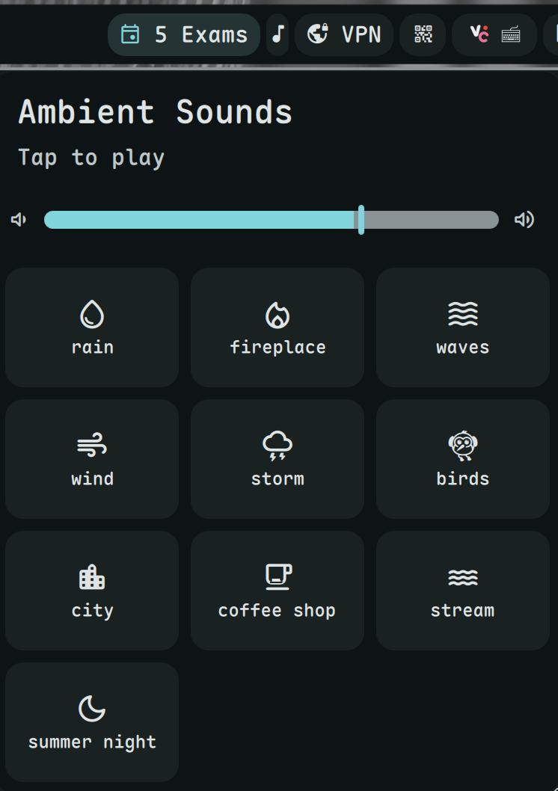

# Ambient Sound

Play ambient sounds for focus and relaxation.



## Install

[<kbd>Install Now</kbd>](dms://plugin/install/ambient-sound)

Or manually:
```bash
git clone https://github.com/hthienloc/dms-ambient-sound ~/.config/DankMaterialShell/plugins/ambientSound
```

## Features

- **14 built-in sounds** - Rain, storm, wind, waves, fireplace, city, etc.
- **Mix & match** - Play multiple sounds simultaneously
- **Presets** - Save and load your favorite sound combinations
- **Sleep timer** - Auto-stop with configurable actions (mute, lock, suspend)

## Usage

| Action | Result |
|--------|--------|
| Left click | Open sound mixer |
| Right click | Mute/unmute |

## Requirements

- `mpv` - Audio player for sound playback
- `socat` - IPC communication with mpv

## License

GPL-3.0